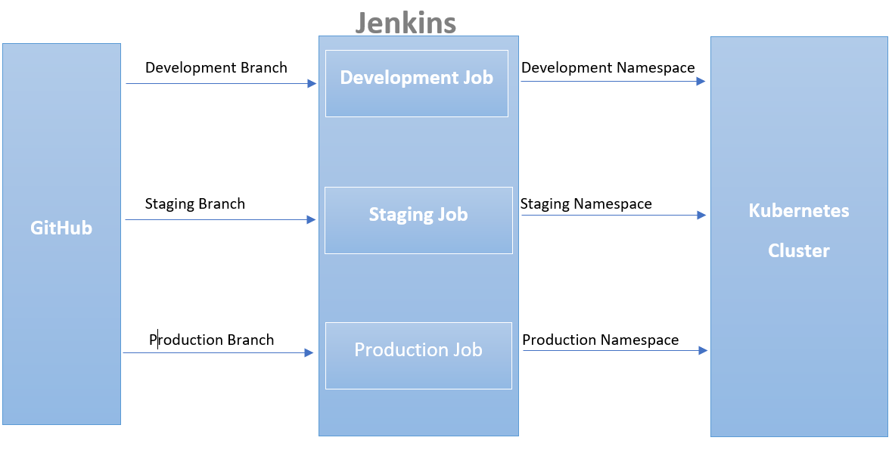
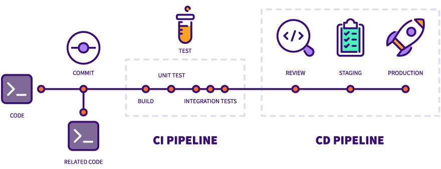

# http_server
A dead simple Ruby web server.
Serves on port 80.
/healthcheck path returns "OK"
All other paths return "Well, hello there!"

`$ ruby webserver.rb`


# Deploy a dead simple web server in minikube using ruby and ansible
A dead simple Ruby web server.
Serves on port 80.
/healthcheck path returns "OK". All other paths return "Well, hello there!"

## Overall Architecture of the deployment

- Code move from GitHub to Jenkins which is deposited in the Ubuntu Virtual Machine I spinned up
- Code get into Jenkins automatically by setting up webhook in Jenkins and notifying GitHub to activate webhook
- To setup webhook in GitHub, go to (url of the repo)/settings/hooks then add webhook.

### Overview of GitHub to Server Architecture    
 [](./Architecture/Overall_Architecture.png) 
 
 - [Install Jenkins on the server](https://docs.docker.com/engine/install/) - Follow this official guide on how to setup docker based on your distribution. 
 - [Install Minikube on the Server for kubernetes](https://minikube.sigs.k8s.io/docs/start/#binary-download) - Follow this official guide on how to setup minikube cluster using binary.
 - [Install Docker container on the server to house the ruby application](https://docs.docker.com/engine/install/) - Follow this official guide on how to setup docker based on your distribution. 
 - [Install kubectl](https://kubernetes.io/docs/tasks/tools/install-kubectl/) - Else you will need to be using minikube kubectl as your command 

### CI/CD Pipeline Architecture with Jenkins
 
 [](./Architecture/CI_CD_Pipeline.png) 
 
 - Setup branches to restrict push to **staging** and **production** branch so that code can only from **development branch** to **staging branch** to **production branch** in the exact order
 - [Install generic webhook pluggin for branch layer trigger of build](https://plugins.jenkins.io/generic-webhook-trigger/) - This is to run build from the **development branch** to **staging branch** to **production branch** 
 - [Create a Jenkins job and use webhook](https://plugins.jenkins.io/generic-webhook-trigger/)
 - Setup Visudo permission for Jenkins to work on the server effectively
 
## Docker Level Architecture
```
$ docker build -t adjusttest .   # To build docker image with the docker image name "adjusttest 
#Login to dockerhub on the server and provide the neccessary credentials
$ docker push danielademeso/adjusttest:${BUILD_NUMBER} #Jenkins will provide the build number that will be used her per build done
$ docker rmi danielademeso/adjusttest:${BUILD_NUMBER}  #To remove the image from the server to reduce memory usage of the server
$ docker system prune -f  #To remove any possible dangling Image 
```

## Kubernetes Level Architecture
- Namespace: Development, Staging and Production
- Loadbalancer in front of the application
- Two pods were stated in the deployment file for high availability

```
# A namesapce for developement, staging and production differented with different port where port 80 is for the production namespace among other service
#Production Layer
$ kubectl -n production get deployment
$ kubectl -n production get pods
$ kubectl -n production get svc #To get url of the load balancer 

#Staging Layer
$ kubectl -n staging get deployment
$ kubectl -n staging get pods
$ kubectl -n staging get svc #To get url of the load balancer

#Development Layer
$ kubectl -n development get deployment
$ kubectl -n development get pods
$ kubectl -n development get svc #To get url of the load balancer
```

For manual deployment, Once the installation is done, clone the repo as below.  
```
$ git clone https://github.com/danade002/http_server
$ kubectl apply -f deploytodev.yaml #For dev environment
$ kubectl apply -f deploytostaging.yaml #For staging environment
$ kubectl apply -f deploytoprod.yaml #For Production environment
```

## Minikube Snippet
 - Checks existing minikube status and starts a single node minikube cluster if none exists.
 - Switches docker environment to minikube.
 - Deletes old images of the application, remove dangling image and rebuilds a new docker image.
 - Gets the minikube's IP address to add it as an External IP to the application loadbalancer service by using minikube tunnel .
 - Creates a Kubernetes Application Deployment for our Ruby WebServer using the docker image pushed to dockerhub.
 - Creates a Kubernetes LoadBalancer Service for our application.
 - Exposes the Application LoadBalancer service to the host via minikube tunnel.
 - Tests the application endpoints response by accessing the published url via curl or can be accessible on the browser if need be using portforwarding due to minikube.


### Testing Application
Due to the restriant of minikube on the loadbalancer,
Minikube has a way of getting loadbalancer External IP which is via minikube tunnel in a detach mode
```
$ minikube tunnel #To get loadbalancer external IP
#production ip
$ curl http://localhost:80/healthcheck
OK 
$ curl http://localhost:80/
Well, hello there 
$ curl http://localhost:80/anything
Well, hello there 

#staging
$ curl http://localhost:90/healthcheck
OK 
$ curl http://localhost:90/
Well, hello there 
$ curl http://localhost:90/anything
Well, hello there

#development ip
$ curl http://localhost:85/healthcheck
OK 
$ curl http://localhost:85/
Well, hello there 
$ curl http://localhost:85/anything
Well, hello there 
```
